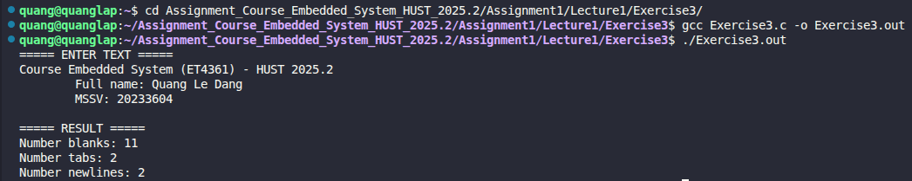

# Exercise 3: Character Counter (Blanks, Tabs, Newlines)

## 📝 Đề bài
### **Write a program to count blanks, tabs, and newlines.** ###  
Dịch: Viết một chương trình bằng ngôn ngữ C để đếm số lượng các ký tự sau trong luồng dữ liệu đầu vào:
* **Blanks** (Khoảng trắng: `' '`)
* **Tabs** (Tab: `\t`)
* **Newlines** (Dòng mới: `\n`)

## 💡 Ý tưởng giải quyết
Chương trình sử dụng vòng lặp `while` kết hợp với hàm `getchar()` để đọc từng ký tự từ `stdin` (đầu vào tiêu chuẩn) cho đến khi gặp ký tự kết thúc tệp (**EOF**). 

Với mỗi ký tự đọc được, chương trình sẽ kiểm tra điều kiện:
1. Nếu là `' '`: Tăng biến đếm `blanks`.
2. Nếu là `\t`: Tăng biến đếm `tabs`.
3. Nếu là `\n`: Tăng biến đếm `newlines`.

## 💻 Mã nguồn (C Solution)

```c
#include <stdio.h>

int main() {
    int blanks = 0;
    int tabs = 0;
    int newlines = 0;
    int c;
    
    printf("===== ENTER TEXT =====\n");
    while((c = getchar()) != EOF) {
        if(c == ' ') blanks++;
        else if (c == '\t') tabs++;
        else if (c == '\n') newlines++;
    }

    printf("\n\n===== RESULT =====\n");
    printf("Number blanks: %d\nNumber tabs: %d\nNumber newlines: %d\n", blanks, tabs, newlines);

    return 0;
}

```

## 🚀 Cách chạy chương trình
1. Di chuyển tới đường dẫn chứa file `Exercise3.c`
2. Biên dịch: `gcc Exercise3.c -o Exercise3.out`
3. Chạy: `./Exercise3.out` (Sau đó nhập văn bản và nhấn `Ctrl+D` để kết thúc).

## 📊 Kết quả thực tế
Đây là ảnh chụp màn hình kết quả khi chạy chương trình với một đoạn văn bản đầu vào:

