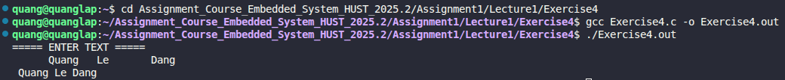

# Exercise 4: Replace Multiple Blanks with a Single Blank

## 📝 Đề bài
### **Write a program to copy its input to its output, replacing each string of one or more blanks by a single blank.** ###  
Dịch: Viết một chương trình sao chép dữ liệu đầu vào sang đầu ra, trong đó mỗi chuỗi có một hoặc nhiều khoảng trắng sẽ được thay thế bằng duy nhất một khoảng trắng.

## 💡 Ý tưởng giải quyết
Chương trình theo dõi ký tự vừa được xử lý trước đó để quyết định có in khoảng trắng tiếp theo hay không:

1. Đọc từng ký tự `c` từ đầu vào bằng `getchar()`.
2. Sử dụng một biến phụ `last_character` để lưu lại ký tự của vòng lặp trước.
3. Điều kiện in ký tự:
   - Nếu `c` không phải là khoảng trắng: Luôn in ra.
   - Nếu `c` là khoảng trắng: Chỉ in ra khi `last_character` không phải là khoảng trắng.
4. Cập nhật `last_character = c` và tiếp tục vòng lặp cho đến khi gặp **EOF**.

## 💻 Mã nguồn (C Solution)

```c
#include <stdio.h>

int main() {
    int c;
    int last_character = '\0'; 

    printf("===== ENTER TEXT =====\n");
    while((c = getchar()) != EOF) {
        if(c != ' ' || last_character != ' ') {
            putchar(c);
        }
        last_character = c;
    }

    return 0;
}
```
## 🚀 Cách chạy chương trình
1. Di chuyển tới đường dẫn chứa file `Exercise4.c`
2. Biên dịch: `gcc Exercise4.c -o Exercise4.out`
3. Chạy: `./Exercise4.out` (Sau đó nhập văn bản và nhấn `Ctrl+D` để kết thúc)

## 📊 Kết quả thực tế
Đây là ảnh chụp màn hình kết quả khi chạy chương trình với một đoạn văn bản đầu vào:

