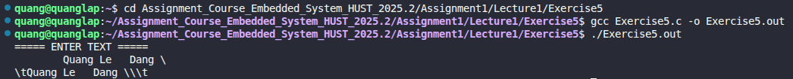

# Exercise 5: Make Non-visible Characters Visible

## 📝 Đề bài
### **Write a program to copy its input to its output, replacing each tab by \t, each backspace by \b, and each backslash by \\. This makes tabs and backspaces visible in an unambiguous way.** ###  
Dịch: Viết một chương trình sao chép đầu vào sang đầu ra, trong đó thay thế mỗi ký tự tab bằng `\t`, mỗi ký tự backspace bằng `\b`, và mỗi ký tự gạch chéo ngược bằng `\\`. Điều này giúp các ký tự không hiển thị trở nên rõ ràng và không bị nhầm lẫn.

## 💡 Ý tưởng giải quyết
Chương trình kiểm tra từng ký tự đọc được để xác định xem đó có phải là ký tự đặc biệt cần được "hiện hình" hay không:

1. Đọc từng ký tự `c` từ đầu vào bằng `getchar()`.
2. Sử dụng cấu trúc rẽ nhánh `if-else` để lọc các ký tự mục tiêu:
   - Nếu `c` là Tab (`\t`): In ra chuỗi ký tự `\t`.
   - Nếu `c` là Backspace (`\b`): In ra chuỗi ký tự `\b`.
   - Nếu `c` là Backslash (`\`): In ra chuỗi ký tự `\\`.
3. Với tất cả các ký tự thông thường khác: In trực tiếp ký tự đó ra đầu ra bằng `putchar(c)`.

## 💻 Mã nguồn (C Solution)

```c
#include <stdio.h>

int main() {
    int c;

    printf("===== ENTER TEXT =====\n");
    while((c = getchar()) != EOF) {
        if(c == '\t') {
            putchar('\\');
            putchar('t');
        }
        else if(c == '\b') {
            putchar('\\');
            putchar('b');
        }
        else if(c == '\\') {
            putchar('\\');
            putchar('\\');
        }
        else {
            putchar(c);
        }
    }

    return 0;
}
```

## 🚀 Cách chạy chương trình
1. Di chuyển tới đường dẫn chứa file `Exercise5.c`
2. Biên dịch: `gcc Exercise5.c -o Exercise5.out`
3. Chạy: `./Exercise5.out` (Sau đó nhập văn bản và nhấn `Ctrl+D` để kết thúc)

## 📊 Kết quả thực tế
Đây là ảnh chụp màn hình kết quả khi chạy chương trình với một đoạn văn bản đầu vào:


