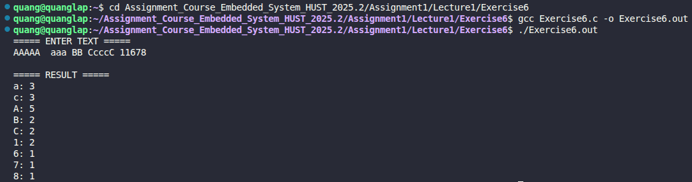

# Exercise 6: Histogram of Character Frequencies

## 📝 Đề bài
### **Write a program to print a histogram of the frequencies of different characters in its input.** ###  
Dịch: Viết một chương trình in ra biểu đồ tần suất xuất hiện của các ký tự khác nhau từ đầu vào.

## 💡 Ý tưởng giải quyết
Chương trình thống kê số lần xuất hiện của các chữ cái (thường và hoa) cùng các chữ số bằng cách sử dụng một mảng lưu trữ:

1. **Khởi tạo:** Tạo một mảng `char_freq` với kích thước đủ cho 26 chữ cái thường, 26 chữ cái hoa và 10 chữ số (tổng cộng 62 vị trí). Khởi tạo tất cả giá trị bằng 0.
2. **Đọc dữ liệu:** Sử dụng `getchar()` để đọc từng ký tự cho đến khi gặp **EOF**.
3. **Phân loại và đếm:**
   - Nếu là ký tự `'a'`-`'z'`: Tăng phần tử tương ứng trong khoảng chỉ số [0 - 25].
   - Nếu là ký tự `'A'`-`'Z'`: Tăng phần tử tương ứng trong khoảng chỉ số [26 - 51].
   - Nếu là ký tự `'0'`-`'9'`: Tăng phần tử tương ứng trong khoảng chỉ số [52 - 61].
4. **Hiển thị:** Duyệt qua mảng, nếu ký tự nào có tần suất > 0 thì in ký tự đó kèm theo số lần xuất hiện tương ứng.

## 💻 Mã nguồn (C Solution)

```c
#include <stdio.h>

#define ALPHA 26
#define NUMBER 10
#define SIZE (ALPHA * 2 + NUMBER)

int main() {
    int char_freq[SIZE];
    int c;

    for(int i = 0; i < SIZE; i++) char_freq[i] = 0;

    printf("===== ENTER TEXT =====\n");
    while((c = getchar()) != EOF) {
        if(c >= 'a' && c <= 'z') char_freq[c-'a']++;
        else if(c >= 'A' && c <= 'Z') char_freq[c - 'A' + ALPHA]++;
        else if(c >= '0' && c <= '9') char_freq[c - '0' + ALPHA * 2]++;
    }

    printf("\n===== RESULT =====\n");
    for(int i = 0; i < SIZE; i++) {
        if(char_freq[i] > 0) {
            if(i < ALPHA) printf("%c: ", 'a' + i);
            else if(i < ALPHA * 2) printf("%c: ", 'A' + (i - ALPHA));
            else printf("%c: ", '0' + (i - ALPHA * 2));
            printf("%d\n", char_freq[i]);
        }
    }

    return 0;
}
```

## 🚀 Cách chạy chương trình
1. Di chuyển tới đường dẫn chứa file `Exercise6.c`
2. Biên dịch: `gcc Exercise6.c -o Exercise6.out`
3. Chạy: `./Exercise6.out` (Sau đó nhập văn bản và nhấn `Ctrl+D` để kết thúc)

## 📊 Kết quả thực tế
Đây là ảnh chụp màn hình kết quả khi chạy chương trình với một đoạn văn bản đầu vào:

