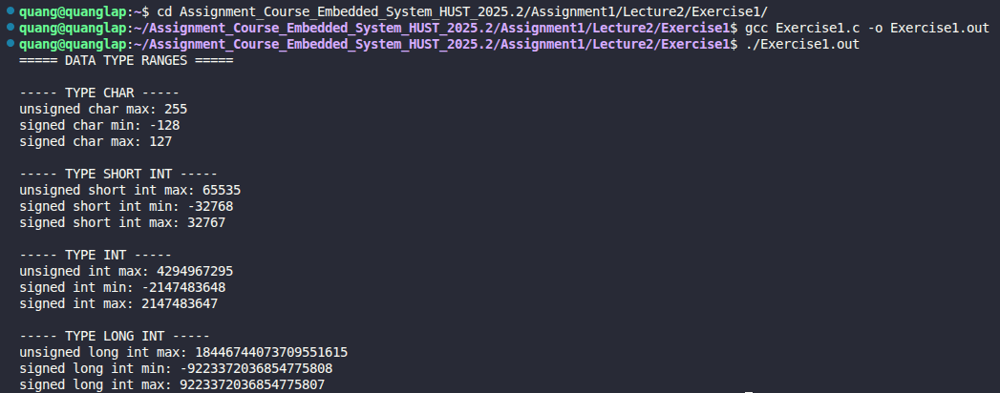

# Exercise 1: Ranges of Data Types

## 📝 Đề bài
### **Write a program to determine the ranges of `char`, `short`, `int`, and `long` variables, both `signed` and `unsigned`, by printing appropriate values from standard headers and by direct computation.** ###  

**Dịch:** Viết một chương trình để xác định phạm vi giá trị (range) của các biến kiểu `char`, `short`, `int`, và `long`, bao gồm cả loại có dấu (`signed`) và không dấu (`unsigned`), bằng cách in các giá trị từ thư viện tiêu chuẩn và bằng cách tính toán trực tiếp.

## 💡 Ý tưởng giải quyết
Kích thước của các kiểu dữ liệu có thể thay đổi tùy thuộc vào kiến trúc máy tính (32-bit hoặc 64-bit). Chương trình sử dụng thư viện tiêu chuẩn để truy xuất chính xác các kích thước này:

1. **Thư viện `<limits.h>`:** Chứa các hằng số macro định nghĩa sẵn giá trị cực đại (`MAX`) và cực tiểu (`MIN`) cho các kiểu số nguyên.
2. **Định dạng in ấn:** - Sử dụng `%d` cho các kiểu số nguyên có dấu nhỏ (`char`, `short`, `int`).
   - Sử dụng `%u` cho `unsigned int`.
   - Sử dụng `%ld` và `%lu` cho kiểu `long` để tránh tràn dữ liệu khi in.

## 💻 Mã nguồn (C Solution)

```c
#include <stdio.h>
#include <limits.h>

int main() {
    printf("===== DATA TYPE RANGES =====\n\n");

    printf("----- TYPE CHAR -----\n");
    printf("unsigned char max:      %d\n", UCHAR_MAX);
    printf("signed char min:        %d\n", SCHAR_MIN);
    printf("signed char max:        %d\n", SCHAR_MAX);
    
    printf("\n----- TYPE SHORT INT -----\n");
    printf("unsigned short int max: %u\n", USHRT_MAX);
    printf("signed short int min:   %d\n", SHRT_MIN);
    printf("signed short int max:   %d\n", SHRT_MAX);

    printf("\n----- TYPE INT -----\n");
    printf("unsigned int max:       %u\n", UINT_MAX);
    printf("signed int min:         %d\n", INT_MIN);
    printf("signed int max:         %d\n", INT_MAX);

    printf("\n----- TYPE LONG INT -----\n");
    printf("unsigned long int max:  %lu\n", ULONG_MAX);
    printf("signed long int min:    %ld\n", LONG_MIN);
    printf("signed long int max:    %ld\n", LONG_MAX);

    return 0;
}
```

## 🚀 Cách chạy chương trình
1. Di chuyển tới đường dẫn chứa file `Exercise1.c`
2. Biên dịch: `gcc Exercise1.c -o Exercise1.out`
3. Chạy: `./Exercise1.out` (Sau đó nhập văn bản và nhấn `Ctrl+D` để kết thúc)

## 📊 Kết quả thực tế
Đây là ảnh chụp màn hình kết quả khi chạy chương trình với một đoạn văn bản đầu vào:

