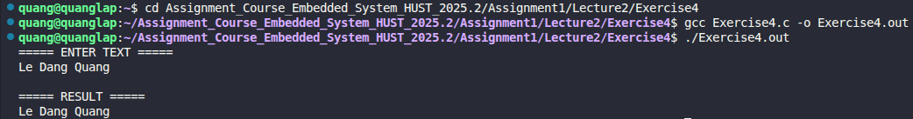

# Exercise 4: Loop Without Logical Operators

## 📝 Đề bài
### **Write a loop equivalent to the `for` loop above without using `&&` or `||`.** ###  
Dịch: Viết một vòng lặp tương đương với vòng lặp `for` dưới đây nhưng không được sử dụng các toán tử logic `&&` (AND) hoặc `||` (OR).

**Vòng lặp gốc:**
```c
for (i = 0; i < lim-1 && (c = getchar()) != '\n' && c != EOF; ++i)
    s[i] = c;
```

## 💡 Ý tưởng giải quyết
Chương trình sử dụng vòng lặp `while(1)` kết hợp với các câu lệnh điều kiện `if` và `break`:

1. **Kiểm tra giới hạn mảng:** Nếu chỉ số `i` đạt đến giới hạn (`MAXLINE - 1`), thoát vòng lặp để tránh tràn bộ nhớ.
2. **Đọc ký tự:** Sử dụng `getchar()` để lấy dữ liệu từ luồng đầu vào.
3. **Kiểm tra điều kiện dừng:**
   - Nếu gặp ký tự xuống dòng (`\n`), thoát vòng lặp.
   - Nếu gặp ký tự kết thúc tệp (`EOF`), thoát vòng lặp.
4. **Lưu trữ:** Nếu không vi phạm các điều kiện trên, lưu ký tự vào mảng và tăng biến đếm `i`.
5. **Kết thúc chuỗi:** Thêm ký tự `\0` vào cuối mảng để tạo thành một chuỗi (string) hợp lệ.

## 💻 Mã nguồn (C Solution)

```c
#include <stdio.h>

#define MAXLINE 100

int main() {
    char string[MAXLINE];
    int c;
    int i = 0;

    printf("===== ENTER TEXT =====\n");
    while(1) {
        // Điều kiện 1: Kiểm tra độ dài mảng
        if(i >= MAXLINE - 1) {
            break;
        }
        
        c = getchar();
        
        // Điều kiện 2: Kiểm tra ký tự xuống dòng
        if(c == '\n') {
            break;
        }
        
        // Điều kiện 3: Kiểm tra kết thúc tệp (EOF)
        if(c == EOF) {
            break;
        }
        
        // Nếu vượt qua tất cả các điều kiện, lưu ký tự vào chuỗi
        string[i++] = c;
    }
    
    string[i] = '\0'; // Kết thúc chuỗi
    
    printf("\n===== RESULT =====\n");
    printf("%s\n", string);

    return 0;
}
```

## 🚀 Cách chạy chương trình
1. Di chuyển tới đường dẫn chứa file `Exercise4.c`
2. Biên dịch: `gcc Exercise4.c -o Exercise4.out`
3. Chạy: `./Exercise4.out` (Sau đó nhập văn bản và nhấn `Ctrl+D` để kết thúc)

## 📊 Kết quả thực tế
Đây là ảnh chụp màn hình kết quả khi chạy chương trình với một đoạn văn bản đầu vào:

