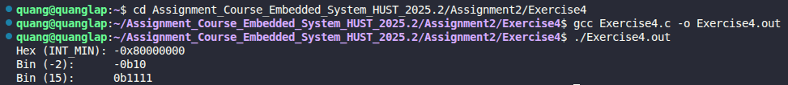

# Exercise 4: Integer to Base-b Conversion (itob)

## 📝 Đề bài
### **Write the function itob(n,s,b) that converts the integer n into a base b character representation in the string s. In particular, itob(n,s,16) formats s as a hexadecimal integer in s.** ###  
Dịch: Viết hàm `itob(n,s,b)` để chuyển đổi số nguyên `n` thành biểu diễn ký tự ở hệ cơ số `b` và lưu vào chuỗi `s`. Cụ thể, `itob(n,s,16)` sẽ định dạng `s` thành một số hệ thập lục phân.

## 💡 Ý tưởng giải quyết
Việc chuyển đổi cơ số dựa trên thuật toán chia lấy dư liên tiếp, nhưng cần đặc biệt lưu ý đến các trường hợp biên trong ngôn ngữ C:

1. **Xử lý số âm cực tiểu (`INT_MIN`):** Trong hệ máy 32-bit, `INT_MIN` là $-2^{31}$. Nếu ta lấy trị tuyệt đối bằng cách `n = -n`, sẽ xảy ra hiện tượng tràn số vì số dương lớn nhất chỉ tới $2^{31}-1$. 
   - **Giải pháp:** Giữ nguyên `n` ở dạng số âm trong suốt quá trình chia. Khi lấy số dư (`n % b`), nếu kết quả âm thì ta lấy giá trị tuyệt đối của số dư đó để chuyển thành ký tự.
2. **Chuyển đổi ký tự:** Sử dụng hàm bổ trợ `itoc` (integer to character):
   - Nếu số dư $0 \le d \le 9$: Trả về $d + '0'$.
   - Nếu số dư $10 \le d \le 15$: Trả về $d - 10 + 'a'$ (cho các hệ cơ số lớn như Hex).
3. **Tiền tố hệ số (Prefix):** Để chuỗi kết quả chuyên nghiệp hơn, chương trình tự động thêm `0b` cho hệ nhị phân (base 2) và `0x` cho hệ thập lục phân (base 16).
4. **Đảo ngược chuỗi:** Do quá trình chia lấy dư tạo ra các chữ số từ hàng đơn vị ngược lên, ta cần hàm `reverse()` để đưa chuỗi về đúng thứ tự đọc.

## 💻 Mã nguồn (C Solution)

```c
#include <stdio.h>
#include <string.h>
#include <limits.h>

#define MAXLEN 100

void reverse(char s[]);
char itoc(int a);
void itob(int n, char s[], int b);

// Chuyển giá trị số dư sang ký tự tương ứng
char itoc(int a) {
    if (a <= 9) return a + '0';
    return a - 10 + 'a';
}

// Hàm chính: Chuyển n sang hệ cơ số b
void itob(int n, char s[], int b) {
    int i = 0;
    int sign = n;  

    // Thuật toán chia lấy dư (xử lý số âm trực tiếp)
    do {
        int digit = n % b;
        if (digit < 0) digit = -digit; 
        s[i++] = itoc(digit);
    } while ((n /= b) != 0); 

    // Thêm tiền tố định dạng
    if (b == 2) {
        s[i++] = 'b';
        s[i++] = '0';
    } else if (b == 16) {
        s[i++] = 'x';
        s[i++] = '0';
    }

    if (sign < 0) s[i++] = '-';
    s[i] = '\0';
    reverse(s);
}

void reverse(char s[]) {
    int i, j;
    char c;
    for (i = 0, j = strlen(s) - 1; i < j; i++, j--) {
        c = s[i];
        s[i] = s[j];
        s[j] = c;
    }
}

int main(void) {
    char s[MAXLEN];

    //* Thử nghiệm với số âm nho nhất
    int n = INT_MIN; 
    itob(n, s, 16);
    printf("Hex (INT_MIN): %s\n", s); // -0x80000000

    itob(-2, s, 2);
    printf("Bin (-2):      %s\n", s); // -0b10

    itob(15, s, 2);
    printf("Bin (15):      %s\n", s); //  0b1111

    return 0;
}
```

## 🚀 Cách chạy chương trình
1. Di chuyển tới đường dẫn chứa file `Exercise4.c`
2. Biên dịch: `gcc Exercise4.c -o Exercise4.out` 
3. Chạy: `./Exercise4.out`

## 📊 Kết quả thực tế
Đây là ảnh chụp màn hình kết quả khi chạy chương trình:

