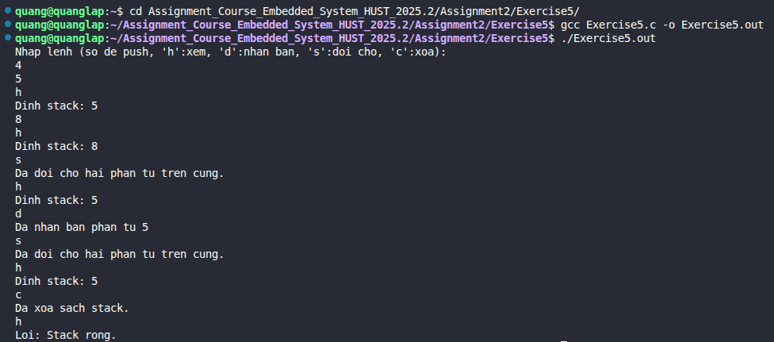

# Exercise 5: Advanced Stack Operations

## 📝 Đề bài
### **Add the commands to print the top elements of the stack without popping, to duplicate it, and to swap the top two elements. Add a command to clear the stack.** ###  
Dịch: Bổ sung các lệnh để in phần tử trên cùng của ngăn xếp mà không lấy ra (pop), lệnh nhân bản phần tử đỉnh, và lệnh đổi chỗ hai phần tử trên cùng. Thêm một lệnh để xóa sạch toàn bộ ngăn xếp.

## 💡 Ý tưởng giải quyết
Để mở rộng khả năng của máy tính sử dụng ngăn xếp (Stack-based calculator), chúng ta triển khai thêm các hàm điều khiển trực tiếp con trỏ ngăn xếp `sp` (stack pointer) và mảng dữ liệu `stack[]`:

1. **Xem phần tử đỉnh (view_head):** Truy cập vào `stack[sp - 1]` để lấy giá trị mà không làm thay đổi biến `sp`.
2. **Nhân bản (duplicate):** Lấy giá trị tại `stack[sp - 1]` và gọi hàm `push()` để đẩy chính giá trị đó vào lại ngăn xếp.
3. **Đổi chỗ (swap):** Sử dụng một biến tạm `temp` để hoán đổi giá trị giữa `stack[sp - 1]` (phần tử thứ nhất) và `stack[sp - 2]` (phần tử thứ hai). Điều kiện bắt buộc là ngăn xếp phải có ít nhất 2 phần tử.
4. **Xóa sạch (clear):** Đưa con trỏ `sp` về giá trị 0. Trong lập trình C, ta không cần xóa dữ liệu cũ trong mảng, chỉ cần đặt lại chỉ số quản lý là ngăn xếp sẽ được coi là trống.

## 💻 Mã nguồn (C Solution)

```c
#include <stdio.h>
#include <stdlib.h>
#include <ctype.h>

#define MAXVAL 100
#define MAXOP  100
#define NUMBER '0'

int getop(char []);
void push(double f);
void view_head(void);
void duplicate(void);
void swap(void);
void clear(void);

int sp = 0;           // Con trỏ ngăn xếp
double stack[MAXVAL]; // Mảng ngăn xếp 

int main(void) {
    int type;
    char s[MAXOP];

    printf("Nhap lenh (so de push, 'h':xem, 'd':nhan ban, 's':doi cho, 'c':xoa):\n");

    while ((type = getop(s)) != EOF) {
        switch (type) {
            case NUMBER:
                push(atof(s));
                break;
            case 'h': //* Print top element
                view_head();
                break;
            case 'd': //* Duplicate
                duplicate();
                break;
            case 's': //* Swap
                swap();
                break;
            case 'c': //* Clear
                clear();
                break;
            case '\n':
                //* Bam Enter chi de ket thuc lenh, khong thuc hien gi them
                break;
            default:
                if (type != ' ' && type != '\t')
                    printf("Lenh khong hop le: %s\n", s);
                break;
        }
    }
    return 0;
}

//? In phan tu tren cung ma khong pop
void view_head(void) {
    if (sp > 0)
        printf("Dinh stack: %g\n", stack[sp - 1]);
    else
        printf("Loi: Stack rong.\n");
}

//? Nhan ban phan tu tren cung
void duplicate(void) {
    if (sp > 0) {
        push(stack[sp - 1]);
        printf("Da nhan ban phan tu %g\n", stack[sp - 1]);
    } else {
        printf("Loi: Stack rong, khong the nhan ban.\n");
    }
}

//? Doi cho hai phan tu tren cung
void swap(void) {
    if (sp > 1) {
        double temp = stack[sp - 1];
        stack[sp - 1] = stack[sp - 2];
        stack[sp - 2] = temp;
        printf("Da doi cho hai phan tu tren cung.\n");
    } else {
        printf("Loi: Khong du phan tu de doi cho.\n");
    }
}

//? Xoa sach ngan xep
void clear(void) {
    sp = 0;
    printf("Da xoa sach stack.\n");
}

//? Them phan tu vao tren cung ngan xep
void push(double f) {
    if (sp < MAXVAL) stack[sp++] = f;
    else printf("Loi: Stack day.\n");
}   

int getop(char s[]) {
    int i = 0, c;
    while ((s[0] = c = getchar()) == ' ' || c == '\t');
    s[1] = '\0';
    if (!isdigit(c) && c != '.') return c;
    if (isdigit(c))
        while (isdigit(s[++i] = c = getchar()));
    if (c == '.')
        while (isdigit(s[++i] = c = getchar()));
    s[i] = '\0';
    return NUMBER;
}
```

## 🚀 Cách chạy chương trình
1. Di chuyển tới đường dẫn chứa file `Exercise5.c`
2. Biên dịch: `gcc Exercise5.c -o Exercise5.out` 
3. Chạy: `./Exercise5.out`
4. Nhập số để đẩy vào stack, sau đó nhập các ký tự `h`, `d`, `s`, `c` để kiểm tra các tính năng nâng cao.

## 📊 Kết quả thực tế
Đây là ảnh chụp màn hình kết quả khi chạy chương trình:

