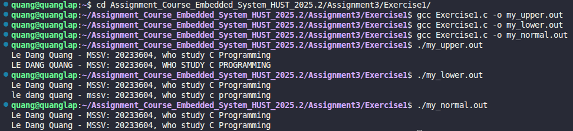

# Exercise 1: Case Conversion based on Executable Name

## 📝 Đề bài
### **Write a program that converts upper case to lower or lower case to upper, depending on the name it is invoked with, as found in argv[0].** ###  
Dịch: Viết một chương trình chuyển đổi chữ hoa thành chữ thường hoặc ngược lại, tùy thuộc vào tên tệp thực thi được gọi (nằm trong biến `argv[0]`).

## 💡 Ý tưởng giải quyết
Trong hệ điều hành Unix/Linux, khi bạn thực thi một tệp, phần tử đầu tiên của mảng đối số (`argv[0]`) chính là tên của tệp thực thi đó. Chúng ta có thể tận dụng đặc điểm này để tạo ra các chương trình đa năng:

1. **Kiểm tra `argv[0]`:** Sử dụng hàm `strstr()` để tìm kiếm từ khóa trong tên file:
   - Nếu tên file chứa chuỗi `"lower"`, chương trình hoạt động ở chế độ `MODE_LOWER`.
   - Nếu tên file chứa chuỗi `"upper"`, chương trình hoạt động ở chế độ `MODE_UPPER`.
   - Các trường hợp khác sẽ giữ nguyên định dạng văn bản (`MODE_NORMAL`).
2. **Xử lý luồng dữ liệu:** Sử dụng `getchar()` và `putchar()` kết hợp với các hàm chuyển đổi `tolower()`, `toupper()` từ thư viện `<ctype.h>`.

## 💻 Mã nguồn (C Solution)

```c
#include <stdio.h>
#include <string.h>
#include <ctype.h>

#define MODE_NORMAL 0
#define MODE_LOWER  1
#define MODE_UPPER  2

// Xác định chế độ hoạt động dựa trên tên file thực thi
int setup_mode(char *argv[]) {
    if (strstr(argv[0], "lower") != NULL) return MODE_LOWER;
    if (strstr(argv[0], "upper") != NULL) return MODE_UPPER;
    return MODE_NORMAL;
}

// Thực thi chuyển đổi ký tự
void run_mode(int mode) {
    int c;
    while ((c = getchar()) != EOF) {
        if (mode == MODE_LOWER) putchar(tolower(c));
        else if (mode == MODE_UPPER) putchar(toupper(c));
        else putchar(c);
    }
}

int main(int argc, char *argv[]) {
    int mode = setup_mode(argv);
    run_mode(mode);
    return 0;
}
```

## 🚀 Cách chạy chương trình
1. Di chuyển tới đường dẫn chứa file `Exercise1.c`
2. Biên dịch thành 3 file: 
    - file đổi thành chữ viết hoa: `gcc Exercise1.c -o my_upper.out`
    - file đổi thành chữ viết thường: `gcc Exercise1.c -o my_lower.out`
    - file không đổi: `gcc Exercise1.c -o my_normal.out`
3. Chạy 3 file: 
    - `./my_upper.out`
    - `./my_lower.out`
    - `./my_normal.out`

## 📊 Kết quả thực tế
Đây là ảnh chụp màn hình kết quả khi chạy chương trình:

