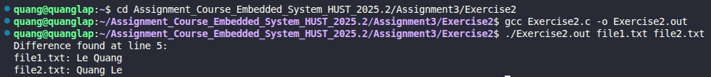

# Exercise 2: File Comparison Program

## 📝 Đề bài
### **Write a program to compare two files, printing the first line where they differ.** ###  
Dịch: Viết một chương trình để so sánh hai tệp tin, in ra dòng đầu tiên mà tại đó nội dung của chúng khác nhau.

## 💡 Ý tưởng giải quyết
Để so sánh hai tệp tin một cách hiệu quả, chương trình thực hiện duyệt song song từng dòng của cả hai tệp:

1. **Quản lý tệp:** Sử dụng `fopen()` để mở hai tệp được cung cấp từ tham số dòng lệnh (`argv[1]` và `argv[2]`). Đảm bảo đóng tệp bằng `fclose()` sau khi hoàn thành để tránh rò rỉ tài nguyên.
2. **Đọc dữ liệu theo dòng:** Sử dụng hàm `fgets()` để đọc từng dòng từ mỗi tệp vào hai bộ đệm (buffers) riêng biệt.
3. **Thuật toán so sánh:**
   - Sử dụng `strcmp()` để so sánh nội dung hai dòng vừa đọc.
   - **Trường hợp khác nhau:** Nếu `strcmp` trả về giá trị khác 0, hoặc một trong hai tệp kết thúc trước (`ptr == NULL`), chương trình sẽ in ra số dòng và nội dung khác biệt rồi dừng lại ngay lập tức.
   - **Trường hợp giống nhau:** Nếu cả hai hàm `fgets` đều trả về `NULL` cùng lúc, điều đó có nghĩa là hai tệp hoàn toàn giống nhau.

## 💻 Mã nguồn (C Solution)

```c
#include <stdio.h>
#include <stdlib.h>
#include <string.h>
#include <stdbool.h>

#define LENGTH_LINE_MAX 1000

int main(int argc, char *argv[]) {  
    if (argc < 3) {
        printf("Usage: %s <file1> <file2>\n", argv[0]);
        return EXIT_FAILURE;
    }

    FILE *file_1 = fopen(argv[1], "r");
    if (file_1 == NULL) {
        printf("Can't open file 1: %s\n", argv[1]);
        return EXIT_FAILURE;
    }

    FILE *file_2 = fopen(argv[2], "r");
    if (file_2 == NULL) {
        printf("Can't open file ; %s\n", argv[2]);
        fclose(file_1); 
        return EXIT_FAILURE;
    }

    char line_1[LENGTH_LINE_MAX];
    char line_2[LENGTH_LINE_MAX];
    int line_number = 1;
    bool difference = false;

    while (true) {
        char *ptr1 = fgets(line_1, LENGTH_LINE_MAX, file_1);
        char *ptr2 = fgets(line_2, LENGTH_LINE_MAX, file_2);

        if (ptr1 == NULL && ptr2 == NULL) break;

        if (ptr1 == NULL || ptr2 == NULL || strcmp(line_1, line_2) != 0) {
            printf("Difference found at line %d:\n", line_number);
            printf("%s: %s", argv[1], ptr1 ? line_1 : "End of file\n");
            printf("%s: %s", argv[2], ptr2 ? line_2 : "End of file\n");
            difference = true;
            break;
        }
        line_number++;
    }

    if (!difference) printf("Files are the same.\n");

    fclose(file_1);
    fclose(file_2);
    return EXIT_SUCCESS;
}
```

## 🚀 Cách chạy chương trình
1. Di chuyển tới đường dẫn chứa file `Exercise1.c`
2. Chuẩn bị dữ liệu: Tạo hai file văn bản, ví dụ file1.txt và file2.txt.
3. Biên dịch: `gcc Exercise2.c -o Exercise2.out` 
3. Chạy và truyền đối số: `./Exercise2.out file1.txt file2.txt`

## 📊 Kết quả thực tế
Đây là ảnh chụp màn hình kết quả khi chạy chương trình:

