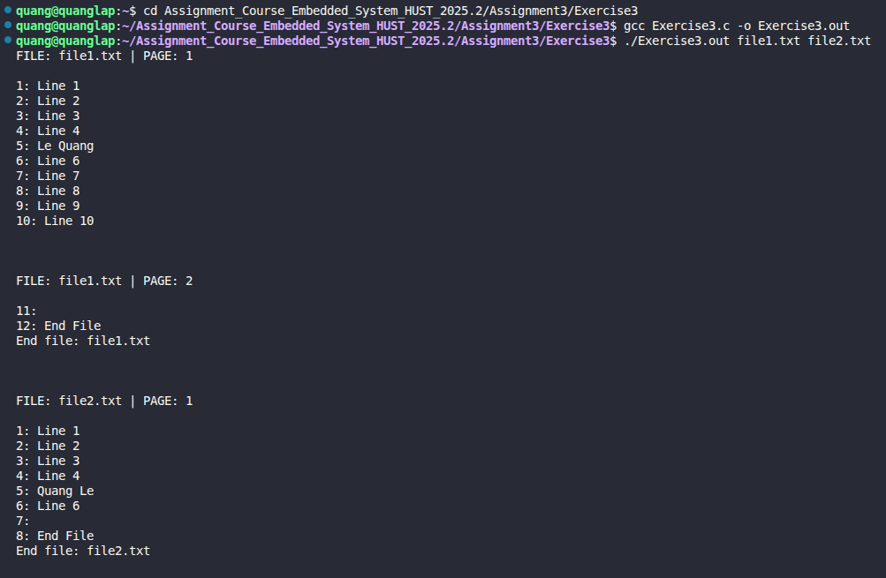

# Exercise 3: File Pagination and Titling Program

## 📝 Đề bài
### **Write a program to print a set of files, starting each new one on a new page, with a title and a running page count for each file.** ###  
Dịch: Viết một chương trình để in một tập hợp các tệp tin, bắt đầu mỗi tệp mới trên một trang mới, kèm theo tiêu đề (tên tệp) và số thứ tự trang tương ứng cho từng tệp.

## 💡 Ý tưởng giải quyết
Chương trình mô phỏng quá trình in ấn tài liệu chuyên nghiệp, nơi các tệp tin được phân đoạn rõ ràng:

1. **Xử lý đa tệp:** Sử dụng vòng lặp duyệt qua mảng `argv[]` để mở và xử lý từng tệp tin được cung cấp từ dòng lệnh.
2. **Cơ chế phân trang:** - Định nghĩa `LINES_PER_PAGE` (số dòng tối đa trên một trang) để kiểm soát thời điểm ngắt trang.
   - Sử dụng một biến đếm dòng (`line_count`) và số trang (`page_number`). Mỗi khi `line_count` đạt ngưỡng giới hạn, chương trình sẽ in thêm các dòng trống để tạo hiệu ứng ngắt trang và in lại Header mới.
3. **Tiêu đề và Đánh số trang:** Mỗi trang mới bắt đầu bằng một dòng Header hiển thị rõ: **Tên tệp hiện tại** và **Số trang hiện tại**.
4. **Trình bày dữ liệu:** Để dễ theo dõi, mỗi dòng nội dung trong tệp được in kèm theo số thứ tự dòng ở phía trước.

## 💻 Mã nguồn (C Solution)

```c
#include <stdio.h>
#include <stdlib.h>
#include <stdbool.h>

#define LENGTH_LINE_MAX 1000
#define LINES_PER_PAGE 10  // Số dòng tối đa mỗi trang (có thể điều chỉnh)

// In nội dung của từng tệp kèm phân trang
void print_file(char *file_name) {
    FILE *file_p = fopen(file_name, "r");
    if (file_p == NULL) {
        fprintf(stderr, "Can't open file: %s\n", file_name);
        return; 
    }

    char line[LENGTH_LINE_MAX];
    int line_count = 0;
    int page_number = 1;

    // Header đầu tiên cho trang 1
    printf("--- FILE: %s | PAGE: %d ---\n\n", file_name, page_number);

    while (fgets(line, LENGTH_LINE_MAX, file_p) != NULL) {
        // Kiểm tra nếu cần chuyển sang trang mới
        if (line_count > 0 && line_count % LINES_PER_PAGE == 0) {
            page_number++;
            printf("\n\n--- FILE: %s | PAGE: %d ---\n\n", file_name, page_number);
        }
        printf("%3d: %s", ++line_count, line);
    }

    printf("\n[End of file: %s]\n", file_name);
    fclose(file_p);
}

int main(int argc, char *argv[]) {
    if (argc < 2) {
        fprintf(stderr, "Usage: %s file1 file2 ...\n", argv[0]);
        exit(EXIT_FAILURE);
    }

    for (int i = 1; i < argc; i++) {
        print_file(argv[i]);
        // Khoảng trống lớn giữa hai tệp tin để phân biệt rõ ràng
        printf("\n\f\n"); 
    }

    return EXIT_SUCCESS;
}
```

## 🚀 Cách chạy chương trình
1. Di chuyển tới đường dẫn chứa file `Exercise3.c`
2. Chuẩn bị dữ liệu: Tạo nhiều file văn bản, ví dụ 2 file là file1.txt và file2.txt.
3. Biên dịch: `gcc Exercise3.c -o Exercise3.out` 
3. Chạy và truyền đối số: `./Exercise3.out file1.txt file2.txt`

## 📊 Kết quả thực tế
Đây là ảnh chụp màn hình kết quả khi chạy chương trình:

