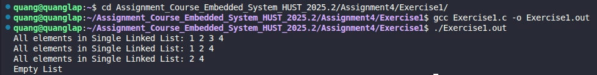

# Exercise 1: Singly Linked List Operations

## 📝 Đề bài
### **In this problem, we continue our study of linked lists by implementing basic operations including display, add to back, find, delete, and free memory.** ###  
Dịch: Trong bài tập này, chúng ta tiếp tục nghiên cứu về danh sách liên kết bằng cách triển khai các thao tác cơ bản bao gồm hiển thị, thêm vào cuối, tìm kiếm, xóa một nút và giải phóng bộ nhớ.
- **(a) display:** Hiển thị tất cả các phần tử trong danh sách.
- **(b) addback:** Thêm một phần tử mới vào cuối danh sách.
- **(c) find:** Tìm kiếm và trả về con trỏ tới nút chứa dữ liệu cho trước.
- **(d) delnode:** Xóa nút được chỉ định bởi con trỏ (kết quả từ hàm find).
- **(e) freelist:** Giải phóng toàn bộ danh sách để tránh rò rỉ bộ nhớ.

## 💡 Ý tưởng giải quyết
Danh sách liên kết đơn là một cấu trúc dữ liệu gồm các nút, mỗi nút chứa dữ liệu và một con trỏ trỏ đến nút kế tiếp:


1. **Thêm vào cuối (addback):** Duyệt từ đầu danh sách đến nút cuối cùng (nút có `next == NULL`), sau đó gán `next` của nút đó cho nút mới vừa tạo.
2. **Tìm kiếm (find):** Duyệt tuần tự qua từng nút và so sánh dữ liệu. Nếu khớp, trả về địa chỉ nút đó.
3. **Xóa nút (delnode):**
   - **Trường hợp xóa đầu:** Cập nhật `head` mới là `head->next` và giải phóng nút cũ.
   - **Trường hợp xóa giữa/cuối:** Cần tìm nút đứng trước nút cần xóa (`prev`), sau đó thực hiện `prev->next = pelement->next` và giải phóng `pelement`.
4. **Giải phóng bộ nhớ (freelist):** Sử dụng một biến tạm để giữ địa chỉ nút tiếp theo trước khi thực hiện `free()` nút hiện tại, đảm bảo không bị mất dấu danh sách.

## 💻 Mã nguồn (C Solution)

```c
#include <stdio.h>
#include <stdlib.h>

struct node {
    int data;
    struct node* next;
};

typedef struct node Node;

// Hiển thị danh sách
void display(Node* head) {
    Node* current_node = head; 
    if (current_node == NULL) {
        printf("Empty List\n");
        return;
    }
    printf("All elements in Single Linked List: ");
    while (current_node != NULL) {
        printf("%d ", current_node->data);
        current_node = current_node->next;
    }
    printf("\n");
}

// Thêm phần tử vào cuối
Node* addback(Node* head, int data) {
    Node* new_node = (Node*)malloc(sizeof(Node));
    if (!new_node) return head;
    new_node->data = data;
    new_node->next = NULL;
    
    if (head == NULL) return new_node;
    
    Node* current = head;
    while(current->next != NULL) current = current->next;
    current->next = new_node;
    return head;
}

// Tìm kiếm phần tử
Node* find(Node* head, int data) {
    Node* current = head;
    while (current != NULL) {
        if (current->data == data) return current;
        current = current->next;
    }
    return NULL;
}

// Xóa một nút bất kỳ
Node* delnode(Node* head, Node* pelement) {
    if (head == NULL || pelement == NULL) return head;
    
    // Nếu nút cần xóa là nút đầu
    if (head == pelement) {
        Node* new_head = head->next;
        free(head);
        return new_head;
    }
    
    // Tìm nút đứng trước nút pelement
    Node* current = head;
    while (current->next != NULL && current->next != pelement) {
        current = current->next;
    }
    
    if (current->next == pelement) {
        current->next = pelement->next;
        free(pelement);
    }
    return head;
}

// Giải phóng toàn bộ danh sách
void freelist(Node* head) {
    Node* temp;
    while (head != NULL) {
        temp = head;
        head = head->next;
        free(temp);
    }
}

int main() {
    Node* head = NULL;
    // Thêm các phần tử vào danh sách
    head = addback(head, 1);
    head = addback(head, 2);
    head = addback(head, 3);
    head = addback(head, 4);

    // Hiển thị danh sách
    display(head);

    // Tìm phần tử có giá trị 3 và xóa
    Node* pelement = find(head, 3);
    head = delnode(head, pelement);
    display(head);

    // Tương tự với phần tử có giá trị 1
    pelement = find(head, 1);
    head = delnode(head, pelement);
    display(head);

    // Xóa danh sách
    freelist(head);
    head = NULL;
    display(head);
    return 0;
}
```

## 🚀 Cách chạy chương trình
1. Di chuyển tới đường dẫn chứa file `Exercise1.c`
2. Biên dịch: `gcc Exercise1.c -o Exercise1.out`
3. Chạy: `./Exercise1.out` 

## 📊 Kết quả thực tế
Đây là ảnh chụp màn hình kết quả khi chạy chương trình:

