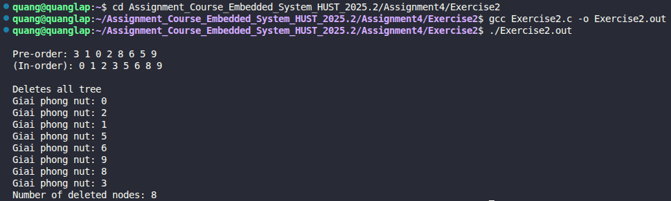

# Exercise 2: Binary Search Tree (BST) Operations

## 📝 Đề bài
### **In this problem, we continue our study of binary trees by implementing basic operations including node allocation, insertion, traversals (Pre-order, In-order), and recursive deletion.** ###  
Dịch: Trong bài tập này, chúng ta tiếp tục nghiên cứu về cây nhị phân bằng cách triển khai các thao tác cơ bản bao gồm cấp phát nút, chèn phần tử, duyệt cây (Pre-order, In-order) và xóa cây bằng đệ quy.
- **(a) talloc:** Cấp phát một nút mới với dữ liệu cho trước.
- **(b) addnode:** Chèn các phần tử `{3, 1, 0, 2, 8, 6, 5, 9}` vào cây theo đúng thứ tự.
- **(c) preorder:** Duyệt và hiển thị các phần tử theo thứ tự Pre-order (Root - Left - Right).
- **(d) inorder:** Duyệt và hiển thị các phần tử theo thứ tự In-order (Left - Root - Right). Kết quả sẽ là một dãy số đã được sắp xếp.
- **(e) deltree:** Xóa toàn bộ các nút của cây sử dụng duyệt Post-order và trả về tổng số nút đã xóa.

## 💡 Ý tưởng giải quyết
Cây nhị phân tìm kiếm (BST) là cấu trúc dữ liệu mà tại mỗi nút, các giá trị ở nhánh trái luôn nhỏ hơn nút gốc và các giá trị ở nhánh phải luôn lớn hơn nút gốc.


1. **Thêm nút (addnode):** Sử dụng đệ quy để so sánh giá trị mới với nút hiện tại. Nếu nhỏ hơn thì đi sang trái, lớn hơn thì đi sang phải cho đến khi tìm thấy vị trí `NULL` để chèn.
2. **Duyệt cây (Traversal):**
   - **Pre-order:** In giá trị gốc trước khi thăm các nhánh con. Thường dùng để tạo bản sao của cây.
   - **In-order:** Thăm nhánh trái, in gốc, rồi thăm nhánh phải. Đây là cách để lấy dữ liệu theo thứ tự tăng dần trong BST.
3. **Xóa cây (deltree):** - Sử dụng duyệt **Post-order** (Left - Right - Root). 
   - Giải thích: Chúng ta phải xóa các nút con trước khi xóa nút gốc của chúng, nếu không sẽ bị mất dấu (pointer) dẫn đến rò rỉ bộ nhớ (memory leak).
   - Biến `count` cộng dồn kết quả từ các nhánh con để trả về tổng số nút đã giải phóng.

## 💻 Mã nguồn (C Solution)

```c
#include <stdio.h>
#include <stdlib.h>

struct tnode {
    int data;
    struct tnode* left;
    struct tnode* right;
};

typedef struct tnode TNode;

// Cấp phát nút mới
TNode* talloc(int data) {
    TNode* newNode = (TNode*)malloc(sizeof(TNode));
    if (newNode != NULL) {
        newNode->data = data;
        newNode->left = NULL;
        newNode->right = NULL;
    }
    return newNode;
}

// Chèn nút vào BST
TNode* addnode(TNode* root, int data) {
    if (root == NULL) return talloc(data);
    
    if (data < root->data) 
        root->left = addnode(root->left, data);
    else if (data > root->data) 
        root->right = addnode(root->right, data);
        
    return root;
}

// Duyệt Pre-order (Root - Left - Right)
void preorder(TNode* root) {
    if (root != NULL) {
        printf("%d ", root->data);
        preorder(root->left);
        preorder(root->right);
    }
}

// Duyệt In-order (Left - Root - Right)
void inorder(TNode* root) {
    if (root != NULL) {
        inorder(root->left);
        printf("%d ", root->data);
        inorder(root->right);
    }
}

// Xóa toàn bộ cây (Post-order)
int deltree(TNode* root) {
    if (root == NULL) return 0;
    
    // Xóa hai nhánh con trước
    int count = deltree(root->left) + deltree(root->right);
    
    // Sau đó mới giải phóng nút gốc
    free(root);
    return count + 1;
}

int main() {
    TNode* root = NULL;
    int values[] = {3, 1, 0, 2, 8, 6, 5, 9};
    int n = sizeof(values) / sizeof(values[0]);

    // Cho các node vào cây
    for (int i = 0; i < n; i++) {
        root = addnode(root, values[i]);
    }

    // Duyệt cây theo kiểu Pre-order
    printf("\nPre-order: ");
    preorder(root);

    // Duyệt cây theo kiểu In-order
    printf("\nIn-order: ");
    inorder(root);
    
    // Xóa toàn bộ cây
    printf("\n\nDeletes all tree\n");
    int deletedNodes = deltree(root);
    root = NULL; 
    printf("Number of deleted nodes: %d\n", deletedNodes);

    return 0;
}
```

## 🚀 Cách chạy chương trình
1. Di chuyển tới đường dẫn chứa file `Exercise2.c`
2. Biên dịch: `gcc Exercise2.c -o Exercise2.out`
3. Chạy: `./Exercise2.out` 

## 📊 Kết quả thực tế
Đây là ảnh chụp màn hình kết quả khi chạy chương trình:

