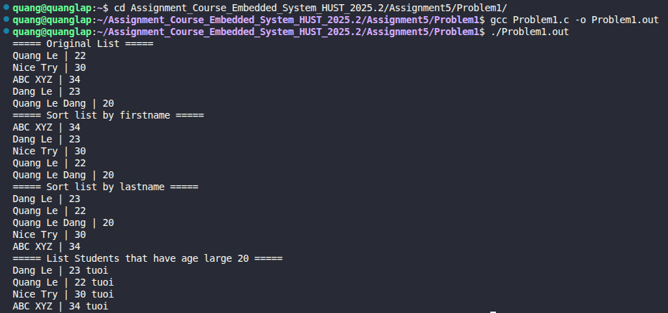

# Problem 6.1: Function Pointers and Callbacks in C

## 📝 Đề bài
### **In this problem, we will use and create functions that utilize function pointers to sort records and process data using callbacks.** ###  
Dịch: Trong bài tập này, chúng ta sẽ sử dụng và tạo các hàm áp dụng con trỏ hàm (function pointers). Chương trình quản lý một danh sách sinh viên gồm: tên (`firstname`), họ (`lastname`) và tuổi (`age`). Các yêu cầu cụ thể:
1. Viết hàm callback để sắp xếp danh sách theo **tên (firstname)** sử dụng `qsort()`.
2. Viết hàm callback để sắp xếp danh sách theo **họ (lastname)** sử dụng `qsort()`.
3. Viết hàm `apply()` để duyệt qua mảng và thực thi một hàm callback trên từng phần tử.
4. Viết hàm `isolder()` để in thông tin sinh viên nếu số tuổi lớn hơn 20.

## 💡 Ý tưởng giải quyết
Bài toán tập trung vào kỹ thuật lập trình hướng sự kiện và tổng quát hóa hành vi bằng con trỏ hàm:

1. **Hàm `qsort` và Callback:** Hàm `qsort` của thư viện chuẩn yêu cầu một hàm so sánh có dạng `int (*fp)(const void*, const void*)`. 
   - Chúng ta thực hiện ép kiểu từ `void*` sang `Student*` để truy cập dữ liệu.
   - Sử dụng `strcmp` để so sánh chuỗi theo thứ tự từ điển.
2. **Hàm `apply`:** Đây là một hàm bậc cao (higher-order function). Thay vì viết cứng logic xử lý bên trong vòng lặp, nó nhận một con trỏ hàm `fp`. Điều này cho phép chúng ta truyền bất kỳ logic nào (như in ấn, lọc dữ liệu) vào mà không cần thay đổi cấu trúc hàm `apply`.
3. **Logic lọc dữ liệu:** Hàm `isolder` đóng vai trò là một bộ lọc (filter), chỉ thực hiện hành động in ấn khi thỏa mãn điều kiện `age > 20`.

## 💻 Mã nguồn (C Solution)

```c
#include <stdio.h>
#include <stdlib.h>
#include <string.h>

// Định nghĩa cấu trúc dữ liệu sinh viên
typedef struct {
    char firstname[50];
    char lastname[50];
    int age;
} Student;

// Callback so sánh theo tên (firstname)
int compare_firstname(const void* pa, const void* pb) {
    const Student* s1 = (const Student*) pa;
    const Student* s2 = (const Student*) pb;
    return strcmp(s1->firstname, s2->firstname);
}

// Callback so sánh theo họ (lastname)
int compare_lastname(const void* pa, const void* pb) {
    const Student* s1 = (const Student*) pa;
    const Student* s2 = (const Student*) pb;
    return strcmp(s1->lastname, s2->lastname);
}

// Hàm callback dùng cho apply: In nếu tuổi > 20
void isolder(Student* s) {
    if (s->age > 20) {
        printf("%s %s | %d tuoi\n", s->firstname, s->lastname, s->age);
    }
}

// Hàm duyệt mảng và áp dụng hàm callback fp
void apply(Student* arr, int num, void (*fp)(Student*)) {
    for (int i = 0; i < num; i++) {
        fp(&arr[i]);
    }
}

// Hàm bổ trợ: In toàn bộ danh sách
void print_students(Student *arr, int n) {
    for (int i = 0; i < n; i++) {
        printf("%-10s %-10s | %d\n", arr[i].firstname, arr[i].lastname, arr[i].age);
    }
}

int main() {
    Student list_student[] = {
        {"Quang", "Le", 22},
        {"Nice", "Try", 30},
        {"ABC", "XYZ", 34},
        {"Dang", "Le", 23},
        {"Quang", "Le Dang", 20}
    };
    int n = sizeof(list_student) / sizeof(list_student[0]);

    printf("===== Original List =====\n");
    print_students(list_student, n);

    // Sắp xếp theo tên
    printf("===== Sort list by firstname =====\n");
    qsort(list_student, n, sizeof(Student), compare_firstname);
    print_students(list_student, n);

    // Sắp xếp theo họ
    printf("===== Sort list by lastname =====\n");
    qsort(list_student, n, sizeof(Student), compare_lastname);
    print_students(list_student, n);

    // Lọc sinh viên trên 20 tuổi bằng apply()
    printf("===== List Students that have age large 20 =====\n");
    apply(list_student, n, isolder);

    return 0;
}
```

## 🚀 Cách chạy chương trình
1. Di chuyển tới đường dẫn chứa file `Problem1.c`
2. Biên dịch: `gcc Problem1.c -o Problem1.out`
3. Chạy: `./Problem1.out` 

## 📊 Kết quả thực tế
Đây là ảnh chụp màn hình kết quả khi chạy chương trình:

