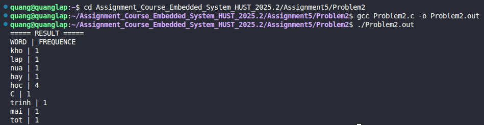

# Problem 6.2: Hash Table with Chaining (Word Frequency Counter)

## 📝 Đề bài
### **In this problem, you will be implementing a hash table with chaining to store the frequency of words in a file.** ###  
Dịch: Trong bài tập này, bạn sẽ triển khai một bảng băm (Hash Table) sử dụng kỹ thuật liên kết (Chaining) để lưu trữ tần suất xuất hiện của các từ trong một file văn bản. 
- Bảng băm được triển khai dưới dạng một mảng các danh sách liên kết đơn.
- Hàm băm (`hash`) xác định chỉ số của danh sách liên kết tương ứng với một từ.
- Hàm `lookup()` thực hiện tìm kiếm: nếu từ đã tồn tại thì trả về con trỏ tới bản ghi đó, nếu chưa có thì tạo bản ghi mới tại vị trí chính xác.
- Hàm `cleartable()` thực hiện giải phóng toàn bộ bộ nhớ đã cấp phát động.

## 💡 Ý tưởng giải quyết
Cấu trúc dữ liệu này giúp tối ưu hóa thời gian tìm kiếm từ độ phức tạp $O(N)$ (danh sách tuyến tính) xuống trung bình $O(N/K)$ (với $K$ là kích thước bảng băm).


1. **Cấu trúc Node:** Mỗi node trong danh sách liên kết chứa:
   - `word`: Con trỏ tới chuỗi ký tự (cấp phát động).
   - `count`: Biến đếm tần suất xuất hiện.
   - `next`: Con trỏ tới phần tử tiếp theo trong cùng một "thùng" (bucket).
2. **Hàm băm (Hash Function):** Sử dụng thuật toán nhân với số nguyên tố (thường là 31) để phân tán các chuỗi ký tự đồng đều vào 101 chỉ số của bảng.
3. **Xử lý va chạm (Collision Handling):** Khi hai từ khác nhau có cùng chỉ số băm, chúng sẽ được thêm vào đầu danh sách liên kết tại chỉ số đó.
4. **Xử lý dữ liệu đầu vào:** Chương trình đọc từ file `book.txt`, sử dụng `ispunct()` để loại bỏ các dấu câu (như dấu phẩy, dấu chấm) ở đầu và cuối từ trước khi đưa vào bảng băm.
5. **Quản lý bộ nhớ:** Sử dụng `strdup()` để tạo bản sao chuỗi và đảm bảo mọi lời gọi `malloc()` đều được đối ứng bằng `free()` trong hàm `cleartable()`.

## 💻 Mã nguồn (C Solution)

```c
#include <stdio.h>
#include <stdlib.h>
#include <string.h>
#include <ctype.h>

#define HASH_SIZE 101

// Định nghĩa cấu trúc node cho danh sách liên kết
typedef struct node_list {
    char* word;
    int count;
    struct node_list *next;
} Node;

// Bảng băm tĩnh
static Node* hash_table[HASH_SIZE];

// Hàm băm chuỗi ký tự
unsigned int hash(char* s) {
    unsigned int hash_value = 0;
    for (hash_value = 0; *s != '\0'; s++) {
        hash_value = *s + 31 * hash_value;
    }
    return hash_value % HASH_SIZE;
}

// Tìm kiếm hoặc tạo mới node trong bảng băm
Node* lookup(char* s, int create) {
    Node* node_present;
    unsigned int h = hash(s);

    // Tìm xem từ đã tồn tại chưa
    for (node_present = hash_table[h]; node_present != NULL; node_present = node_present->next) {
        if (strcmp(s, node_present->word) == 0) { 
            return node_present;
        }
    }

    // Nếu chưa có và yêu cầu create = 1, tạo node mới
    if (create) {
        node_present = (Node*)malloc(sizeof(Node));
        if (node_present == NULL || (node_present->word = strdup(s)) == NULL) {
            return NULL;
        }
        node_present->count = 0;
        node_present->next = hash_table[h]; // Thêm vào đầu danh sách
        hash_table[h] = node_present;
    }
    return node_present;
}

// Giải phóng bộ nhớ toàn bộ bảng băm
void cleartable() {
    Node *node_present, *node_temp;
    for (int i = 0; i < HASH_SIZE; i++) {
        node_present = hash_table[i];
        while (node_present != NULL) {
            node_temp = node_present;
            node_present = node_present->next;
            free(node_temp->word); 
            free(node_temp);      
        }
        hash_table[i] = NULL;
    }
}

int main() {
    FILE* f = fopen("book.txt", "r");
    if (f == NULL) {
        printf("Error: Could not open book.txt!\n");
        return 1;
    }

    char raw_word[100];
    while (fscanf(f, "%s", raw_word) != EOF) {
        // Logic loại bỏ dấu câu ở đầu/cuối từ
        int start = 0, end = strlen(raw_word) - 1;
        while (start <= end && ispunct((unsigned char)raw_word[start])) start++;
        while (end >= start && ispunct((unsigned char)raw_word[end])) end--;
        
        if (start <= end) {
            int len = end - start + 1;
            char clean_word[101];
            strncpy(clean_word, &raw_word[start], len);
            clean_word[len] = '\0'; 
            
            Node* p = lookup(clean_word, 1);
            if (p != NULL) p->count++;
        }
    }
    fclose(f);

    // In kết quả thống kê

    printf("===== RESULT =====");
    printf("%s | %s\n", "WORD", "FREQUENCY");
    printf("---------------------------\n");
    for (int i = 0; i < HASH_SIZE; i++) {
        for (Node *np = hash_table[i]; np != NULL; np = np->next) {
            printf("%s | %d\n", np->word, np->count);
        }
    }

    cleartable();
    return 0;
}
```

## 🚀 Cách chạy chương trình
1. Di chuyển tới đường dẫn chứa file `Problem2.c`
2. Biên dịch: `gcc Problem1.c -o Problem2.out`
3. Chạy: `./Problem2.out` 

## 📊 Kết quả thực tế
Đây là ảnh chụp màn hình kết quả khi chạy chương trình:

