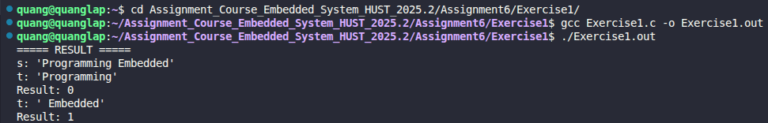

# Exercise 1: String End Comparison (strend)

## 📝 Đề bài
### **Write the function strend(s, t), which returns 1 if the string t occurs at the end of the string s, and zero otherwise.** ###  
Dịch: Viết hàm `strend(s, t)`, hàm này trả về 1 nếu chuỗi `t` xuất hiện ở cuối chuỗi `s`, và trả về 0 trong các trường hợp còn lại.

## 💡 Ý tưởng giải quyết
Để kiểm tra xem một chuỗi có nằm ở cuối chuỗi khác hay không, chúng ta sử dụng con trỏ để dịch chuyển vị trí so sánh một cách tối ưu:

1. **Kiểm tra độ dài:** Đầu tiên, tính độ dài của chuỗi `s` và `t`. Nếu chuỗi `t` dài hơn chuỗi `s`, chắc chắn `t` không thể nằm ở cuối `s`, trả về 0.
2. **Dịch chuyển con trỏ:** Di chuyển con trỏ của chuỗi `s` tới vị trí bắt đầu của đoạn cuối có độ dài bằng với chuỗi `t`. 
   - Công thức vị trí: `s = s + (s_length - t_length)`
3. **So sánh nội dung:** Duyệt qua cả hai chuỗi từ vị trí đã dịch chuyển cho đến khi kết thúc chuỗi:
   - Nếu có bất kỳ ký tự nào khác nhau, trả về 0.
   - Nếu duyệt hết chuỗi mà tất cả ký tự đều khớp, trả về 1.

## 💻 Mã nguồn (C Solution)

```c
#include <stdio.h>
#include <string.h>

int strend(char* s, char* t) {
    int s_length = strlen(s);
    int t_length = strlen(t);

    // Nếu độ dài t lớn hơn s thì không thể khớp
    if (t_length > s_length) return 0;

    // Di chuyển con trỏ s đến vị trí bắt đầu so sánh
    s += (s_length - t_length);

    // So sánh từng ký tự của s (tính từ vị trí mới) với t
    while (*s != '\0') {
        if (*s != *t) return 0;
        s++;
        t++;
    }

    return 1;
}

int main() {
    char string1[] = "Programming Embedded";
    char string2[] = "Programming";
    char string3[] = " Embedded";

    printf("===== RESULT =====\n");
    printf("s: '%s'\n", string1);
    printf("t: '%s'\n", string2);
    printf("Result: %d\n", strend(string1, string2));
    printf("t: '%s'\n", string3);
    printf("Result: %d\n", strend(string1, string3));

    return 0;
}
```

## 🚀 Cách chạy chương trình
1. Di chuyển tới đường dẫn chứa file `Exercise1.c`
2. Biên dịch: `gcc Exercise1.c -o Exercise1.out`
3. Chạy: `./Exercise1.out` 

## 📊 Kết quả thực tế
Đây là ảnh chụp màn hình kết quả khi chạy chương trình:

