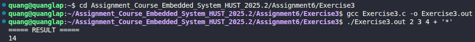

# Exercise 3: Reverse Polish Notation (RPN) Calculator via Command Line

## 📝 Đề bài
### **Write the program expr, which evaluates a reverse Polish expression from the command line, where each operator or operand is a separate argument. For example, `expr 2 3 4 + *` evaluates 2 * (3+4).** ###  
Dịch: Viết chương trình `expr` để tính toán giá trị của một biểu thức Ba Lan ngược từ dòng lệnh, trong đó mỗi toán tử hoặc toán hạng là một đối số riêng biệt. Ví dụ: `expr 2 3 4 + *` sẽ tính giá trị của 2 * (3+4).

## 💡 Ý tưởng giải quyết
Biểu thức Ba Lan ngược (RPN) là cách viết toán học mà toán tử đứng sau các toán hạng. Để giải quyết bài toán này, chúng ta sử dụng cấu trúc dữ liệu **Stack**:

1. **Xử lý tham số dòng lệnh:** Sử dụng `argc` (số lượng đối số) và `argv` (mảng các chuỗi đối số) để đọc dữ liệu trực tiếp khi thực thi chương trình.
2. **Cơ chế Stack:**
   - Nếu đối số là một **số (operand)**: Đẩy (push) giá trị đó vào Stack.
   - Nếu đối số là một **toán tử (operator)** như `+`, `-`, `*`, `/`: Lấy (pop) hai giá trị trên cùng của Stack ra, thực hiện phép toán, sau đó đẩy kết quả ngược lại vào Stack.
3. **Thứ tự phép tính:** Lưu ý với phép trừ và phép chia, giá trị lấy ra trước (`op2`) sẽ là số bị trừ/số chia.
4. **Kết quả:** Sau khi duyệt hết các đối số, giá trị cuối cùng còn lại trong Stack chính là kết quả của biểu thức.

## 💻 Mã nguồn (C Solution)

```c
#include <stdio.h>
#include <string.h>
#include <stdlib.h>
#include <ctype.h>  

#define MAXSTACK 100

double stack[MAXSTACK];
int sp = 0; 

// Hàm đẩy dữ liệu vào ngăn xếp
void push(double f) {
    if (sp < MAXSTACK)
        stack[sp++] = f;
    else
        printf("Error: Stack Full\n");
}

// Hàm lấy dữ liệu từ ngăn xếp
double pop() {
    if (sp > 0) return stack[--sp];
    else {
        printf("Error: Stack Empty\n");
        return 0.0;
    }
}

int main(int argc, char *argv[]) {
    double op2;
    char *s;

    // Duyệt qua các đối số dòng lệnh (bỏ qua tên chương trình argv[0])
    while (--argc > 0) {
        s = *++argv; 
        
        // Kiểm tra nếu là toán tử (độ dài chuỗi bằng 1 và không phải chữ số)
        if (!isdigit(s[0]) && strlen(s) == 1) {
            switch (s[0]) {
                case '+':
                    push(pop() + pop());
                    break;
                case '*':
                    push(pop() * pop());
                    break;
                case '-':
                    op2 = pop();
                    push(pop() - op2);
                    break;
                case '/':
                    op2 = pop();
                    if (op2 != 0.0) push(pop() / op2);
                    else printf("Error: Zero divisor\n");
                    break;
                default:
                    printf("Error: Invalid operator %s\n", s);
                    break;
            }
        } else {
            // Nếu là số, chuyển từ chuỗi sang double và đẩy vào stack
            push(atof(s));
        }
    }

    // Kết quả cuối cùng là phần tử duy nhất còn lại trong stack
    printf("Result: %.2f\n", pop());
    return 0;
}
```

## 🚀 Cách chạy chương trình
1. Di chuyển tới đường dẫn chứa file `Exercise3.c`
2. Biên dịch: `gcc Exercise3.c -o Exercise3.out`
3. Chạy chương trình với các đối số cách nhau bằng dấu cách: `./Exercise3.out 2 3 4 + *` 

## 📊 Kết quả thực tế
Đây là ảnh chụp màn hình kết quả khi chạy chương trình:

