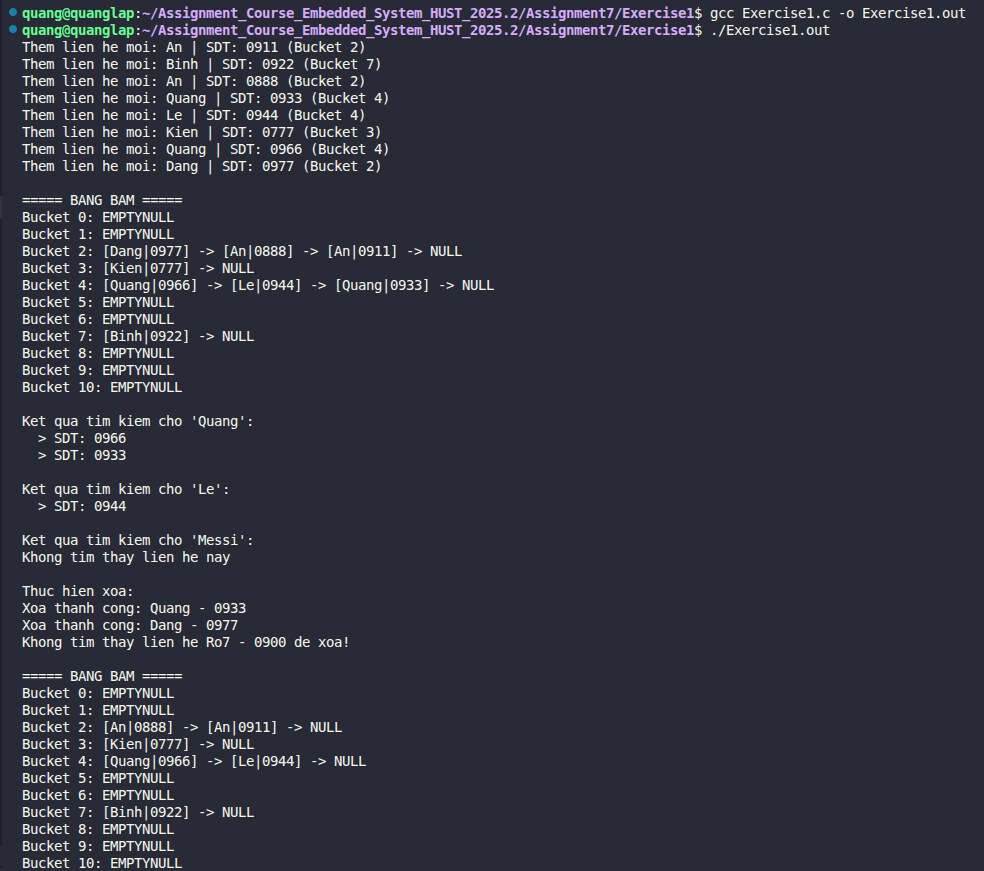

# Bài tập: Quản lý danh bạ bằng Hash Table (Chaining)

## 📝 Đề bài
### **Xây dựng một chương trình C quản lý danh bạ điện thoại đơn giản bằng bảng băm để tối ưu hóa việc tìm kiếm và lưu trữ.** ###  

**Yêu cầu chi tiết:**
- **Cấu trúc dữ liệu:** Sử dụng một mảng `buckets[]` các danh sách liên kết đơn để xử lý xung đột (collision) theo phương pháp **Chaining**. Mỗi nút (Node) chứa thông tin tên liên hệ, số điện thoại và con trỏ `next`.
- **Hàm băm:** Cài đặt hàm băm sử dụng công thức đa thức (nhân với số 31) để ánh xạ chuỗi tên vào kích thước bảng băm.
- **Các chức năng chính:**
    1. `insert`: Thêm liên hệ mới (xử lý được trường hợp trùng tên nhưng khác số điện thoại).
    2. `search`: Tìm kiếm tất cả số điện thoại theo tên cho trước.
    3. `delete`: Xóa một liên hệ cụ thể khỏi bảng băm.
    4. `display`: In toàn bộ cấu trúc bảng băm để kiểm tra các thùng (buckets).

## 💡 Ý tưởng giải quyết
Bảng băm là cấu trúc dữ liệu cho phép truy cập dữ liệu với độ phức tạp trung bình là $O(1)$. Tuy nhiên, do nhiều tên có thể băm ra cùng một chỉ số, cơ chế Chaining được áp dụng:

1. **Xử lý xung đột:** Khi hai tên khác nhau có cùng giá trị băm, chúng sẽ được nối vào một danh sách liên kết tại vị trí đó.
2. **Hàm băm đa thức:** $$hash\_val = \sum_{i=0}^{n-1} s[i] \times 31^{n-1-i}$$
   Công thức này giúp phân tán các tên liên hệ đồng đều hơn trên các Bucket, giảm thiểu chiều dài của danh sách liên kết.
3. **Quản lý bộ nhớ:** Mỗi khi thêm liên hệ, chương trình cấp phát động (`malloc`) cho một `Person`. Khi xóa hoặc kết thúc, cần đảm bảo giải phóng bộ nhớ để tránh rò rỉ (memory leak).

## 💻 Mã nguồn (C Solution)

```c
#include <stdio.h>
#include <stdlib.h>
#include <string.h>

#define TABLE_SIZE 11 

//TODO Cấu trúc nút trong danh sách liên kết
typedef struct Person {
    char name[50];
    char phone[15];
    struct Person* next;
} Person;

//TODO Bảng băm
Person* buckets[TABLE_SIZE];

//TODO Hàm băm
unsigned int hash(char *str) {
    unsigned int hash_val = 0;
    while (*str) {
        hash_val = (hash_val * 31) + *str;
        str++;
    }
    return hash_val % TABLE_SIZE;
}

//TODO Chèn liên hệ (Cho phép trùng tên, nhưng khác số điện thoại)
void insert(char *name, char *phone) {
    unsigned int index = hash(name);
    
    //? Kiểm tra xem cặp name-phone này đã tồn tại chưa để tránh trùng lặp dư thừa
    Person* temp = buckets[index];
    while (temp) {
        if (strcmp(temp->name, name) == 0 && strcmp(temp->phone, phone) == 0) {
            printf("Lien he '%s - %s' da ton tai!\n", name, phone);
            return;
        }
        temp = temp->next;
    }

    Person* newNode = (Person*)malloc(sizeof(Person));
    strcpy(newNode->name, name);
    strcpy(newNode->phone, phone);
    
    //? Cho liên hệ mới vào đầu danh sách liên kết
    newNode->next = buckets[index];
    buckets[index] = newNode;
    printf("Them lien he moi: %s | SDT: %s (Bucket %d)\n", name, phone, index);
}

//TODO Tìm kiếm tất cả các số điện thoại trùng tên
void search(char *name) {
    unsigned int index = hash(name);
    Person* temp = buckets[index];
    int count = 0;
    
    printf("\nKet qua tim kiem cho '%s':\n", name);
    while (temp != NULL) {
        if (strcmp(temp->name, name) == 0) {
            printf("  > SDT: %s\n", temp->phone);
            count++;
        }
        temp = temp->next;
    }
    if (count == 0) printf("Khong tim thay lien he nay\n");
}

//TODO Xóa một liên hệ (dựa trên tên và số điện thoại)
void delete_contact(char *name, char *phone) {
    unsigned int index = hash(name);
    Person* temp = buckets[index];
    Person* prev = NULL;

    while (temp != NULL) {
        if (strcmp(temp->name, name) == 0 && strcmp(temp->phone, phone) == 0) {
            if (prev == NULL) buckets[index] = temp->next;
            else prev->next = temp->next;
            
            free(temp);
            printf("Xoa thanh cong: %s - %s\n", name, phone);
            return;
        }
        prev = temp;
        temp = temp->next;
    }
    printf("Khong tim thay lien he %s - %s de xoa!\n", name, phone);
}

//TODO Hàm in bảng băm 
void display() {
    printf("\n===== BANG BAM =====\n");
    for (int i = 0; i < TABLE_SIZE; i++) {
        printf("Bucket %d: ", i);
        Person* temp = buckets[i];
        if (!temp) printf("EMPTY");
        while (temp) {
            printf("[%s|%s] -> ", temp->name, temp->phone);
            temp = temp->next;
        }
        printf("NULL\n");
    }
}

int main() {
    //* Khoi tao buckets
    for (int i = 0; i < TABLE_SIZE; i++) buckets[i] = NULL;

    //* Nhập 8 liên hệ 
    insert("An", "0911");
    insert("Binh", "0922");
    insert("An", "0888"); 
    insert("Quang", "0933");
    insert("Le", "0944");
    insert("Kien", "0777"); 
    insert("Quang", "0966");
    insert("Dang", "0977");

    //* In ra bảng băm
    display();

    //* Tim kiem ten
    search("Quang");    
    search("Le");  
    search("Messi"); 

    //* Xóa 2 liên hệ
    printf("\nThuc hien xoa:\n");
    delete_contact("Quang", "0933");   
    delete_contact("Dang", "0977"); 
    delete_contact("Ro7", "0900"); 

    display();

    return 0;
}
```

## 🚀 Cách chạy chương trình
1. Di chuyển tới đường dẫn chứa file `Exercise1.c`
2. Biên dịch: `gcc Exercise1.c -o Exercise1.out`
3. Chạy: `./Exercise1.out` 

## 📊 Kết quả thực tế
Đây là ảnh chụp màn hình kết quả khi chạy chương trình:

