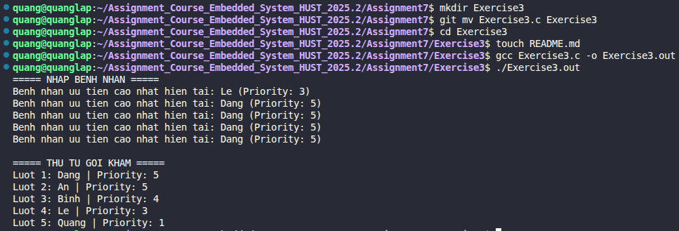

# Bài tập 3: Hàng đợi ưu tiên (Priority Queue) sử dụng Binary Heap

## 📝 Đề bài
### **Mô phỏng hệ thống hàng đợi khám bệnh tại bệnh viện, trong đó bệnh nhân có mức độ cấp cứu cao hơn sẽ được khám trước.** ###  

**Yêu cầu chi tiết:**
- **Cấu trúc dữ liệu:** Sử dụng mảng để biểu diễn một **Max-Heap**. Mỗi phần tử là một `struct Patient` gồm tên và mức độ ưu tiên (`priority`).
- **Quy ước:** Giá trị `priority` càng lớn thì mức độ ưu tiên càng cao.
- **Xử lý công bằng:** Nếu hai bệnh nhân có cùng mức ưu tiên, bệnh nhân nào đến trước (`arrival_order`) sẽ được khám trước.
- **Các hàm cần cài đặt:**
    1. `push`: Thêm bệnh nhân vào hàng đợi và thực hiện **Heapify-up**.
    2. `pop`: Lấy bệnh nhân có ưu tiên cao nhất ra và thực hiện **Heapify-down**.
    3. `peek`: Xem bệnh nhân đứng đầu hàng đợi mà không xóa.

## 💡 Ý tưởng giải quyết
Sử dụng Binary Heap giúp các thao tác thêm và lấy phần tử ưu tiên nhất có độ phức tạp thời gian là $O(\log N)$, hiệu quả hơn nhiều so với việc dùng mảng sắp xếp $O(N)$.


1. **Biểu diễn mảng:** Với một nút ở vị trí `i`:
   - Nút cha (Parent) nằm ở vị trí: $(i-1)/2$.
   - Nút con trái (Left child) nằm ở vị trí: $2i + 1$.
   - Nút con phải (Right child) nằm ở vị trí: $2i + 2$.
2. **Heapify-up (Khi thêm mới):** Chèn phần tử vào cuối mảng, sau đó so sánh với nút cha. Nếu lớn hơn cha, thực hiện đổi chỗ và tiếp tục hướng lên gốc.
3. **Heapify-down (Khi lấy ra):** Đưa phần tử cuối mảng lên gốc thay thế cho phần tử vừa lấy ra. Sau đó so sánh với các con, đổi chỗ với nút con lớn nhất để duy trì đặc tính Max-Heap.
4. **Xử lý ưu tiên kép:** Sử dụng thêm trường `arrival_order` để so sánh khi `priority` bằng nhau, đảm bảo nguyên tắc FIFO (First In First Out) cho các bệnh nhân cùng mức độ bệnh.

## 💻 Mã nguồn (C Solution)

```c
#include <stdio.h>
#include <stdlib.h>
#include <string.h>

#define MAX_SIZE 100

typedef struct {
    char name[50];
    int priority;
    int arrival_order; 
} Patient;

Patient heap[MAX_SIZE];
int size = 0;
int order_counter = 0; //? Đếm thứ tự đến

//TODO Hàm đổi chỗ 2 bệnh nhân
void swap(Patient *a, Patient *b) {
    Patient temp = *a;
    *a = *b;
    *b = temp;
}

//TODO So sánh độ ưu tiên (Nếu ưu tiên bằng nhau, ai đến trước sẽ đứng trước)
int compare(Patient p1, Patient p2) {
    if (p1.priority > p2.priority) return 1;
    if (p1.priority < p2.priority) return -1;
    //? Cùng ưu tiên, xét thứ tự đến
    if (p1.arrival_order < p2.arrival_order) return 1;
    return -1;
}

//TODO Hàm push và heapify-up
void push(char *name, int priority) {
    if (size >= MAX_SIZE) return;

    Patient p;
    strcpy(p.name, name);
    p.priority = priority;
    p.arrival_order = ++order_counter;

    heap[size] = p;
    int i = size;
    size++;

    //? Heapify-up: so sánh với cha (parent = (i-1)/2)
    while (i != 0 && compare(heap[i], heap[(i - 1) / 2]) > 0) {
        swap(&heap[i], &heap[(i - 1) / 2]);
        i = (i - 1) / 2;
    }
}

//TODO Hàm pop và heapify-down
Patient pop() {
    Patient top = heap[0];
    heap[0] = heap[size - 1];
    size--;

    int i = 0;
    while (1) {
        int largest = i;
        int left = 2 * i + 1;
        int right = 2 * i + 2;

        if (left < size && compare(heap[left], heap[largest]) > 0) largest = left;
        if (right < size && compare(heap[right], heap[largest]) > 0) largest = right;

        if (largest != i) {
            swap(&heap[i], &heap[largest]);
            i = largest;
        } else break;
    }
    return top;
}

//TODO Hàm peek 
void peek() {
    if (size > 0) {
        printf("Benh nhan uu tien cao nhat hien tai: %s (Priority: %d)\n", heap[0].name, heap[0].priority);
    }
}

int main() {
    //* Nhập 5 bệnh nhân
    printf("===== NHAP BENH NHAN =====\n");
    push("Le", 3); peek();
    push("Dang", 5); peek();
    push("Quang", 1); peek();
    push("An", 5); peek(); 
    push("Binh", 4); peek();

    //* Gọi khám lần lượt
    printf("\n===== THU TU GOI KHAM =====\n");
    int i = 1;
    while (size > 0) {
        Patient p = pop();
        printf("Luot %d: %s | Priority: %d\n", i++, p.name, p.priority);
    }

    return 0;
}
```

## 🚀 Cách chạy chương trình
1. Di chuyển tới đường dẫn chứa file `Exercise3.c`
2. Biên dịch: `gcc Exercise3.c -o Exercise3.out`
3. Chạy: `./Exercise3.out` 

## 📊 Kết quả thực tế
Đây là ảnh chụp màn hình kết quả khi chạy chương trình:

